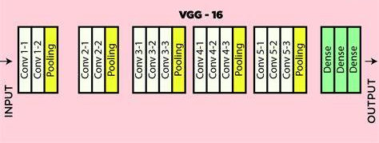

# Chicken-Disease-Classification-Project

## Introduction

This project is designed to build an AI-based poultry disease detection system using deep learning. The goal is to classify poultry diseases from images, enabling farmers to easily monitor and manage their poultry health. By using Convolutional Neural Networks (CNNs) and transfer learning with the VGG16 pre-trained model, this system can predict diseases from chicken images accurately. The solution includes a web-based user interface where users can upload chicken images, and the system will predict the disease in real-time.

## Objectives

The objectives of this project are:

- **Disease Detection**: Develop an AI-powered model to classify poultry diseases from images.
- **Real-Time Prediction**: Provide users with real-time predictions through an intuitive web interface.
- **Data Management**: Ensure efficient ingestion and processing of large image datasets.
- **Model Performance Tracking**: Implement tools to monitor the model's accuracy and training history.
- **Cloud Deployment**: Deploy the trained model on cloud services (Render, AWS, or Azure) for scalability and real-time access.

## Model Architecture

The model for poultry disease detection leverages **VGG16**, a pre-trained deep learning model. The architecture consists of:

### 1. Base Model (VGG16)
   - A 16-layer deep CNN architecture originally trained on the ImageNet dataset.
   - The VGG16 model is used for feature extraction, detecting basic patterns like edges, textures, and shapes, which are essential for detecting poultry diseases.



### 2. Custom Layers
   - After VGG16, custom fully connected layers and a softmax output layer are added to adapt the model to the poultry disease classification task.
   - The classifier layers are fine-tuned using the poultry disease dataset to improve classification accuracy.

### 3. Output Layer
   - The output is a classification of the input image, with each class representing a different disease in chickens.

### Model Details
- **Parameters**:
  - Image Size: [224, 224, 3]
  - Batch Size: 32
  - Epochs: 10
  - Classes: 4
  - Learning Rate: 0.01
  - Using ImageNet weights
  - Data augmentation enabled

### Layers:
- **Convolutional Layers**: 13 convolutional layers that extract features from images.
- **Fully Connected Layers**: Three fully connected layers with 4096 neurons, which help in classification.
- **Output Layer**: A softmax activation layer, which classifies the input image into one of the predefined disease classes.

## Approach

### Pre-Trained Model: VGG16

VGG16 is a well-known architecture in the deep learning community, consisting of 16 layers:
   - **Convolutional Layers**: 13 convolutional layers that extract features from images.
   - **Pooling Layers**: Max-pooling layers reduce spatial dimensions to make computation more efficient.
   - **Fully Connected Layers**: Three fully connected layers with 4096 neurons, which help in classification.
   - **Output Layer**: A softmax activation layer, which classifies the input image into one of the predefined disease classes.

Using VGG16's pre-trained weights on ImageNet helps the model learn essential features quickly and efficiently. The model is fine-tuned using our poultry disease dataset, ensuring it specializes in poultry disease classification.

### Transfer Learning Approach

```
+---------------------+
|      Input Layer    |
|      (224x224x3)    |
+---------------------+
          |
          v
+---------------------+
|      VGG16          |
|  (Base Model)       |
|                     |
|  Conv1: 64 Filters  |
|  Conv2: 64 Filters  |
|  Pool1              |
|                     |
|  Conv3: 128 Filters |
|  Conv4: 128 Filters |
|  Pool2              |
|                     |
|  Conv5: 256 Filters |
|  Conv6: 256 Filters |
|  Pool3              |
+---------------------+
          |
          v
+---------------------+
|  Fully Connected    |
|        (Dense1)     |
|      4096 Neurons   |
+---------------------+
          |
          v
+---------------------+
|  Fully Connected    |
|        (Dense2)     |
|      4096 Neurons   |
+---------------------+
          |
          v
+---------------------+
|     Output Layer    |
|      (Softmax)      |
|      4 Classes      |
+---------------------+


   - **Feature Extraction**: VGG16 is used as a feature extractor, leveraging its ability to detect fundamental image features (like edges and textures).
   - **Fine-Tuning**: The top layers of the VGG16 model are replaced with custom layers to tailor the model for poultry disease classification.
   - **Data Augmentation**: Techniques such as rotation, flipping, and zooming are applied to the dataset, making the model more robust and preventing overfitting.

## Model Performance

### Test Accuracy
- **Accuracy**: 85.60%
- **Loss**: 0.3822
- **Precision**: [Insert Precision Here]
- **Recall**: [Insert Recall Here]
- **F1 Score**: [Insert F1 Score Here]

### High-Level Design (HLD)

### System Architecture Overview
```
+-------------------+
|   User Interface  |
|   (Flask App)     |
+-------------------+
          |
          v
+-------------------+
|   API Endpoints   |
+-------------------+
          |
          v
+-------------------+
|   Data Ingestion  |
+-------------------+
          |
          v
+-------------------+
|   Model Training  |
+-------------------+
          |
          v
+-------------------+
|   Model Evaluation|
+-------------------+
```

### Major Components and their Interactions
- **User Interface**: Interacts with users and sends requests to the API.
- **API Endpoints**: Handles requests and routes them to the appropriate components.
- **Data Ingestion**: Responsible for fetching and preparing data for training.
- **Model Training**: Trains the CNN model using the prepared data.
- **Model Evaluation**: Evaluates the trained model's performance.

### Technology Stack
- **Frontend**: Flask, HTML, CSS, JavaScript, Bootstrap
- **Backend**: Python, TensorFlow
- **Data Versioning**: DVC
- **Deployment**: Render, AWS, Azure

### Key Features
- Real-time disease classification
- Modular architecture for easy updates and maintenance

## Low-Level Design (LLD)

### Detailed Component Architecture
```
+---------------------+
|   Data Ingestion    |
|---------------------|
| - download_file()   |
| - extract_zip_file()|
+---------------------+

+---------------------+
|   Model Training    |
|---------------------|
| - train()           |
| - save_model()      |
+---------------------+

+---------------------+
|   Model Evaluation  |
|---------------------|
| - evaluate_model()  |
| - log_results()     |
+---------------------+
```

### Data Structures
- **DataIngestionConfig**: Configuration for data ingestion, including:
  - `root_dir`: Directory for storing data.
  - `kaggle_dataset`: Kaggle dataset identifier for downloading data.
  - `local_data_file`: Path to the local data file.
  - `unzip_dir`: Directory for unzipping the downloaded data.

- **PrepareBaseModelConfig**: Configuration for model preparation, including:
  - `root_dir`: Directory for storing the base model.
  - `base_model_path`: Path to save the initial base model.
  - `updated_base_model_path`: Path to save the updated model.
  - `params_image_size`: Image size for the model input.
  - `params_learning_rate`: Learning rate for training.
  - `params_include_top`: Whether to include the top layers of the model.
  - `params_weights`: Weights to use for the model.
  - `params_classes`: Number of classes for classification.

- **TrainingConfig**: Configuration for training parameters, including:
  - `root_dir`: Directory for storing training artifacts.
  - `trained_model_path`: Path to save the trained model.
  - `updated_base_model_path`: Path to the updated base model.
  - `training_data`: Path to the training data.
  - `params_epochs`: Number of epochs for training.
  - `params_batch_size`: Batch size for training.
  - `params_is_augmentation`: Whether to use data augmentation.
  - `params_image_size`: Image size for the model input.

### User Workflow
1. **Start the Application**: Run the application using the command:
   ```bash
   python app.py
   ```
   Open your web browser and navigate to the local host and port specified in the terminal.

2. **Upload an Image**: Click the "Upload Image" button on the web interface. Select an image file from your device that you want to classify.

3. **Make a Prediction**: After uploading, click the "Predict" button. The application will process the image and display a loading indicator while waiting for the prediction.

4. **View the Results**: Once the prediction is complete, the result will be displayed in the designated output area. You can also view the training history by clicking the "View Training History" button.

### Pipeline Workflows
```
+-------------------+
|   Data Ingestion  |
+-------------------+
          |
          v
+-------------------+
| Model Preparation |
+-------------------+
          |
          v
+-------------------+
|   Model Training  |
+-------------------+
          |
          v
+-------------------+
| Model Evaluation  |
+-------------------+
```

### API Endpoints
- **`/predict`**: 
  - **Method**: POST
  - **Description**: Endpoint for making predictions on uploaded images.
  - **Request Body**: 
    ```json
    {
      "image": "base64_encoded_image_data"
    }
    ```
  - **Response**: 
    ```json
    {
      "prediction": "class_label"
    }
    ```

- **`/status`**: 
  - **Method**: GET
  - **Description**: Endpoint for checking the service status.
  - **Response**: 
    ```json
    {
      "status": "running"
    }
    ```

## History Analysis

### Overview
The history page provides insights into the training process of the poultry disease detection model. It displays key metrics and visualizations that help track the model's performance over time.

### Key Metrics
- **Model Accuracy vs Validation Accuracy**: A plot showing how the model's accuracy improves during training compared to validation accuracy.
- **Model Loss vs Validation Loss**: A plot illustrating the loss values during training and validation, helping to identify overfitting or underfitting.

### High-Level Design (HLD)
The history page summarizes the high-level design of the application, detailing the overall architecture and workflow.

### Low-Level Design (LLD)
It also provides insights into the low-level design, focusing on the implementation details and architecture of the model.

### Data Ingestion
The history page explains how the Kaggle API is used for data ingestion, ensuring that the latest datasets are available for training.

## Workflows

1. Update config.yaml
2. Update secrets.yaml [Optional]
3. Update params.yaml
4. Update the entity
5. Update the configuration manager in src config
6. Update the components
7. Update the pipeline 
8. Update the main.py
9. Update the dvc.yaml


# How to run?
### STEPS:

Clone the repository

```bash
https://github.com/VisionExpo/Chicken_Disease_Detection-main
```
### STEP 01- Create a virtual environment named "chicken" using Python 3.10

```bash
python -m venv chicken
```

```bash
# Activate the virtual environment
# On Windows
chicken\Scripts\activate

# On macOS/Linux
source chicken/bin/activate
```

### STEP 02- install the requirements
```bash
pip install -r requirements.txt
```

```bash
# Finally run the following command
python app.py
```

Now,
```bash
open up your local host and port
